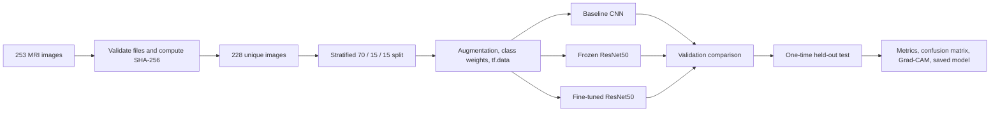
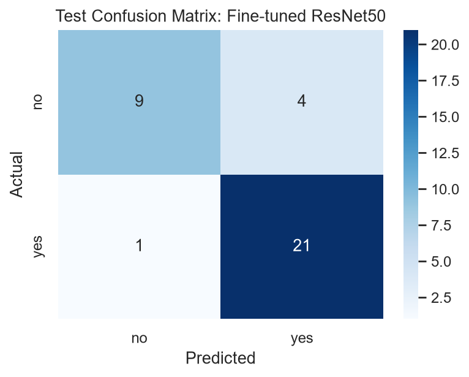

# Brain Tumor Detection in MRI Scans

An end-to-end computer vision pipeline for binary brain MRI classification, built with TensorFlow and transfer learning. The project goes beyond model training: it audits and deduplicates the source images, prevents duplicate leakage across data splits, benchmarks three model strategies, selects the winner on validation data, evaluates it once on a held-out test set, and uses Grad-CAM to inspect model attention.

> **Result:** the selected fine-tuned ResNet50 achieved **95.5% tumor recall**, **89.4% F1**, and **85.7% accuracy** on the held-out test set. It identified 21 of 22 tumor-positive scans, with one false negative. Results are from a 35-image test set and should be interpreted as proof-of-concept evidence, not clinical performance.

## Project at a glance

| Area | Implementation |
|---|---|
| Problem | Binary classification of MRI scans as tumor (`yes`) or no tumor (`no`) |
| Data quality | Image validation plus SHA-256 exact-duplicate detection before splitting |
| Modeling | Custom CNN baseline, frozen ImageNet ResNet50, selectively fine-tuned ResNet50 |
| Leakage control | Stratified 70/15/15 split with explicit hash-disjointness assertions |
| Training | Augmentation, class weighting, early stopping, learning-rate reduction, best-checkpoint saving |
| Evaluation | Accuracy, precision, recall, F1, ROC-AUC, classification report, confusion matrix |
| Explainability | Grad-CAM overlays from the selected ResNet50 convolutional features |
| Reproducibility | Fixed random seed, deterministic split logic, training histories, metrics, and publication-safe plots |

## Features

### Leakage-resistant data preparation

Medical-image collections can contain renamed or relocated copies of the same scan. A random split performed before checking for duplicates would allow the same image content to appear in both training and evaluation data, inflating results. This pipeline computes a SHA-256 hash for every readable image and removes exact duplicates **before** the split.

- Audited 253 source images: 155 tumor and 98 no-tumor.
- Removed 25 exact duplicates (9.9%) without deleting the source files.
- Retained 228 unique images: 141 tumor and 87 no-tumor.
- Created stratified train/validation/test partitions of 159/34/35 images.
- Asserted that image hashes are disjoint across all three partitions.

### Deliberate model experimentation

The experiment is structured to measure the value of transfer learning rather than presenting a single model in isolation:

1. A compact CNN establishes a from-scratch baseline.
2. ResNet50 is used as a frozen ImageNet feature extractor.
3. The final residual block (`conv5_*`) is selectively unfrozen and trained at a lower learning rate (`1e-5`), while Batch Normalization layers remain frozen for stability on the small dataset.

The input pipeline resizes scans to 224 × 224, applies model-specific normalization, augments training images with controlled rotation, zoom, translation, and contrast changes, and uses `tf.data` parallel mapping and prefetching. Balanced class weights reduce bias toward the majority tumor class.

### Evaluation discipline

Models are ranked on validation F1, then recall and ROC-AUC. This emphasizes detection of tumor-positive cases while retaining a balance between false positives and false negatives. The test partition is reserved for the selected model and evaluated once at a fixed 0.50 threshold.



## Results

### Validation model comparison

| Model | Accuracy | Precision | Recall | F1 | ROC-AUC |
|---|---:|---:|---:|---:|---:|
| **Fine-tuned ResNet50** | **91.2%** | **90.9%** | **95.2%** | **93.0%** | **96.3%** |
| Frozen ResNet50 | 85.3% | 86.4% | 90.5% | 88.4% | 92.7% |
| Baseline CNN | 64.7% | 80.0% | 57.1% | 66.7% | 72.2% |

Transfer learning produced a substantial improvement over the custom CNN. Selective fine-tuning then improved validation F1 by 4.7 percentage points over the frozen ResNet50 and by 26.4 points over the baseline.

### Held-out test performance

| Accuracy | Precision | Recall | F1 | ROC-AUC |
|---:|---:|---:|---:|---:|
| 85.7% | 84.0% | **95.5%** | 89.4% | 89.2% |

The selected model correctly identified 21 of 22 tumor-positive scans. Its four false positives indicate that specificity remains the main area for improvement, while the single false negative is particularly important in a screening-oriented setting.



### Explainability

Grad-CAM overlays provide a qualitative check of which spatial regions contributed to each prediction. Several tumor-positive examples show attention overlapping visible lesions, but some activations also extend to borders or other structures. These maps are useful for model debugging and hypothesis generation; they are not clinical explanations or proof that the model learned medically valid features.

The notebook generates `outputs/gradcam_examples.png` locally. That file is intentionally excluded from version control because it reproduces source MRI scans. It should only be published if the dataset's current license explicitly permits redistribution of source or derived images.

## Repository structure

```text
.
|-- README.md
|-- .gitignore
|-- brain_tumor_mri_resnet_pipeline.ipynb   # Complete executable analysis
|-- archive/                                # Local only; ignored by Git
|   `-- brain_tumor_dataset/
|       |-- no/                             # No-tumor MRI scans
|       `-- yes/                            # Tumor-positive MRI scans
`-- outputs/
    |-- *_history.csv                       # Included per-epoch metrics
    |-- model_validation_comparison.csv     # Included model-selection evidence
    |-- selected_model_test_metrics.csv     # Included held-out results
    |-- selected_model_test_confusion_matrix.png
    |-- *_split.csv                         # Generated locally; ignored
    |-- gradcam_examples.png                # Contains source scans; ignored
    `-- *.keras                             # Generated locally; ignored
```

## Dataset setup

The MRI files are not redistributed in this repository. Download **[Brain MRI Images for Brain Tumor Detection](https://www.kaggle.com/datasets/navoneel/brain-mri-images-for-brain-tumor-detection)** from Kaggle and credit the dataset creator in any derivative work.

Before redistributing MRI files or figures containing them, review the current license displayed on the Kaggle dataset page. Being able to download a public dataset does not by itself establish permission to republish it elsewhere.

### Option 1: manual download

1. Open the Kaggle dataset page and select **Download**.
2. Extract the archive into this repository's `archive/` directory.
3. Confirm that the retained dataset has the following layout:

```text
archive/
`-- brain_tumor_dataset/
    |-- no/
    `-- yes/
```

The Kaggle archive may also contain duplicated top-level `yes/` and `no/` directories. The notebook deliberately uses only `archive/brain_tumor_dataset` and performs content-hash deduplication within that retained copy.

### Option 2: Kaggle CLI

After configuring your Kaggle API credentials, run:

```bash
python -m pip install kaggle
kaggle datasets download \
  -d navoneel/brain-mri-images-for-brain-tumor-detection \
  -p archive \
  --unzip
```

Never commit `kaggle.json`; it may contain an API token and is covered by this repository's `.gitignore`.

## Run the project

The notebook was executed with Python 3.12 and expects the dataset at `archive/brain_tumor_dataset`.

```bash
python -m venv .venv

# Windows PowerShell
.venv\Scripts\Activate.ps1

python -m pip install --upgrade pip
python -m pip install jupyter tensorflow pandas numpy scikit-learn matplotlib seaborn pillow
jupyter notebook brain_tumor_mri_resnet_pipeline.ipynb
```

Run the notebook from the repository root. The first ResNet50 run downloads ImageNet weights if they are not already cached. All generated artifacts are written to `outputs/`. The `.gitignore` permits only small aggregate metrics and publication-safe plots; raw metadata, split manifests with local paths, scan-containing figures, and trained models remain local.

For a quick review without retraining, open [`brain_tumor_mri_resnet_pipeline.ipynb`](brain_tumor_mri_resnet_pipeline.ipynb) and inspect the included artifacts:

- [`model_validation_comparison.csv`](outputs/model_validation_comparison.csv) — side-by-side validation metrics.
- [`selected_model_test_metrics.csv`](outputs/selected_model_test_metrics.csv) — final held-out test performance.
- [`dataset_cleaning_summary.csv`](outputs/dataset_cleaning_summary.csv) — raw and deduplicated sample counts.
- [`fine-tuned_resnet50_training_curves.png`](outputs/fine-tuned_resnet50_training_curves.png) — optimization behavior.
- [`selected_model_test_confusion_matrix.png`](outputs/selected_model_test_confusion_matrix.png) — error distribution.

## Model artifacts

Training creates several Keras checkpoints, including `outputs/selected_brain_tumor_model.keras`. These binaries are intentionally excluded from Git history: the selected model is approximately 218 MB, while the intermediate checkpoints add substantial repository weight.

For a portfolio repository, publish only the selected model as an optional **GitHub Release asset** and link to that release from this section. Anyone who only wants to inspect or reproduce the work can use the notebook without downloading a checkpoint. Keep the proof-of-concept and non-clinical-use warning with any distributed model.

## Publishing notes

The ignore rules are designed so the repository can be staged safely after the README and `.gitignore` are committed:

- `archive/` and downloaded ZIP files stay local.
- Keras models and TensorFlow logs stay local.
- Metadata and split CSVs containing absolute workstation paths stay local.
- `class_sample_images.png` and `gradcam_examples.png` stay local because they reproduce dataset images.
- Aggregate metrics, learning histories, training curves, EDA summaries, and the confusion matrix remain eligible for publication.

Jupyter stores rendered outputs inside the `.ipynb` file itself, which `.gitignore` cannot filter. Before committing an executed notebook, clear the outputs of cells that display sample MRIs or Grad-CAM overlays unless the dataset license explicitly allows those images to be republished.

## Key findings

- **Transfer learning was decisive.** The pretrained ResNet50 generalized much better than the CNN trained from scratch on this limited dataset.
- **Targeted fine-tuning added value.** Unfreezing only the final residual block improved every validation metric while limiting the number of weights adapted to the small training set.
- **Data hygiene materially changed the experiment.** Removing 25 duplicates before splitting reduced the risk of optimistic leakage-driven performance.
- **Recall was strong, but specificity needs work.** On the held-out set the model missed one tumor scan but incorrectly flagged four of thirteen no-tumor scans.
- **Interpretability requires caution.** Grad-CAM sometimes overlaps plausible lesion regions, yet attention outside those regions reinforces the need for expert review and external validation.

## Limitations and responsible use

This repository demonstrates an analytical workflow, not a deployable medical device. The dataset contains only 228 unique images and no patient identifiers, scanner/acquisition metadata, tumor subtype or grade, segmentation masks, or independent external cohort. The split is image-level because patient-level grouping information is unavailable; consequently, related scans from the same unknown patient cannot be ruled out. ResNet50 is also pretrained on natural images, creating a domain gap with MRI data.

The results therefore have wide uncertainty and should not be used for diagnosis, treatment, triage, or claims of clinical validity.

## Next steps

- Validate on a larger, independent, patient-grouped dataset from different scanners and institutions.
- Report confidence intervals and performance across clinically relevant subgroups.
- Improve specificity through threshold analysis, probability calibration, and cost-sensitive evaluation.
- Compare with architectures designed or pretrained for medical imaging.
- Add lesion segmentation or localization when expert-annotated masks are available.
- Review Grad-CAM and error cases with a radiology domain expert.

## Technology stack

Python · TensorFlow/Keras · ResNet50 · `tf.data` · scikit-learn · pandas · NumPy · Pillow · Matplotlib · Seaborn · Jupyter
